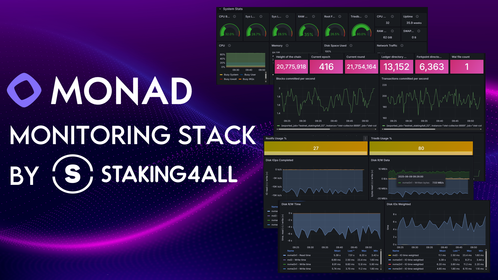

<p align="center">
  
</p>

# Monad Monitoring

This repo helps validators and node operators monitor their own Monad node. It runs a small Docker stack (Prometheus, Grafana, node-exporter and, depending on the mode, an OpenTelemetry collector) next to a binary-installed Monad node and gives you ready-made Grafana dashboards.

You need a running Monad node (binary install) and Docker with the Compose plugin (`docker compose`, v2.20 or newer).

## Background: OpenTelemetry vs the native metrics endpoint

Originally a Monad node only sent its metrics out over OpenTelemetry (OTel), to a collector that forwarded them to the Monad Foundation. There was no local endpoint you could point Prometheus at, so this repo ran its own OTel collector: the node sent metrics to it, the collector exposed them as a Prometheus endpoint for your dashboards, and (for validators) still forwarded them to the Monad Foundation.

Recent Monad releases also include a native Prometheus endpoint. Since **v0.16.0** (testnet) and **v0.16.1** (mainnet) it is **enabled by default** on `0.0.0.0:9143` at `/metrics`, configured under `[metrics]` in `node.toml`. This repo can scrape that endpoint directly, so if you want to move your own monitoring off OTel in the future, you can switch to Mode 3 without changing the dashboards.

Mode 3 uses only this local endpoint and drops OTel completely. It is expected that the Monad Foundation will eventually collect metrics from validators itself instead of validators pushing them, at which point OTel forwarding would no longer be needed. Until that is announced, validators that are required to push metrics should stay on Mode 2.

This repo offers three modes, so you can move whenever you are ready.

## Choose a mode

| | Mode | Compose file | Who it is for |
|---|---|---|---|
| 1 | OTel, local only | `docker-compose-binary-open-telem-local.yaml` | Any node (full node or validator) that wants OTel-based monitoring **without** sending metrics to the Monad Foundation |
| 2 | OTel, forward to Monad | `docker-compose-binary-open-telem.yaml` | Validators still on the OTel route that **must** keep pushing metrics to the Monad Foundation |
| 3 | Native Prometheus, no OTel | `docker-compose-binary-monad-prom.yaml` | Validators (or any node) on v0.16+ that want to use the node's own `:9143/metrics` endpoint and stop using OTel |

How the data flows in each mode:

- **Mode 1:** node → OTel collector (this repo) → Prometheus → Grafana
- **Mode 2:** node → OTel collector (this repo) → Prometheus → Grafana, and collector → Monad Foundation
- **Mode 3:** Prometheus scrapes the node's own endpoint on `:9143` → Grafana. No OTel collector, nothing pushed to the Monad Foundation.

What each mode needs from you:

| | Mode 1 | Mode 2 | Mode 3 |
|---|---|---|---|
| SECP key in `collector/otel-collector-config.yaml` | no | **yes** | no |
| `VALIDATOR_SECP` in `.env` | only for the v3 dashboard | only for the v3 dashboard | only for the v3 dashboard |
| Node sends OTel to `localhost:4317` | yes | yes | no |
| Firewall rules for port 9143 | no | no | **yes** |
| Monad's bundled `otelcol` service | stopped | stopped | stopped (OTel not used) |

> **Validators:** Mode 1 sends nothing to the Monad Foundation. Use Mode 2 instead, otherwise your validator stops reporting metrics with no warning.

## Common setup (all modes)

Clone the repo into the `monad` user's home directory:

```bash
cd /home/monad
git clone https://github.com/staking4all/monad-monitoring.git
cd monad-monitoring
```

Edit `.env`:

```bash
nano .env
```

```bash
# Grafana login - change the password
GF_SECURITY_ADMIN_USER=admin
GF_SECURITY_ADMIN_PASSWORD=change-me

# Validators only: your validator SECP public key.
# Used by the textfile-collector script for the v3 dashboard (block proposals).
# Full nodes can leave this as is.
VALIDATOR_SECP=<add_your_validator_secp_public_address>
```

Then follow the section for your mode.

## Mode 1: OTel, local only

1. **Stop Monad's bundled collector.** The `otelcol` service installed with Monad listens on port 4317, the same port this stack's collector uses. The node keeps sending to `localhost:4317`, which is now this repo's collector.

   ```bash
   sudo systemctl stop otelcol
   sudo systemctl disable otelcol
   ```

2. **Start the stack.**

   ```bash
   docker compose -f docker-compose-binary-open-telem-local.yaml up -d
   ```

   Four containers start: otel-collector, prometheus, grafana and node-exporter.

3. **Check that metrics arrive.**

   ```bash
   curl -s http://127.0.0.1:8889/metrics | grep monad_execution_ledger_block_num
   ```

No SECP key is needed in the collector config for this mode.

## Mode 2: OTel, forward to Monad (validators)

1. **Add your SECP key to the collector config.** In `collector/otel-collector-config.yaml`, replace `SECP_KEY` with your validator's SECP public key:

   ```bash
   nano collector/otel-collector-config.yaml
   ```

   ```yaml
     resource:
       attributes:
       - key: secp_key
         value: "036bbd589054dacff9febaa948f88f2d057537efcfea3624c2405873ed380548d3"
         action: upsert
   ```

   The collector attaches this key to every metric it forwards, so the Monad Foundation can tell which validator the data belongs to.

2. **Stop Monad's bundled collector.** This stack's collector replaces it and does the forwarding itself.

   ```bash
   sudo systemctl stop otelcol
   sudo systemctl disable otelcol
   ```

3. **Start the stack.**

   ```bash
   docker compose -f docker-compose-binary-open-telem.yaml up -d
   ```

4. **Check that metrics arrive.**

   ```bash
   curl -s http://127.0.0.1:8889/metrics | grep monad_execution_ledger_block_num
   ```

   The output should include a `secp_key="..."` label with your key.

## Mode 3: Native Prometheus endpoint

1. **Check that the node's endpoint is on.** It is enabled by default since v0.16.0. Make sure `/home/monad/monad-bft/config/node.toml` doesn't contain `enabled = false` under `[metrics]`, then:

   ```bash
   ss -ltnp | grep 9143
   curl -s http://127.0.0.1:9143/metrics | head -5
   ```

   The endpoint must listen on `0.0.0.0` (the default), not `127.0.0.1`, because Prometheus runs in a container.

2. **Set up the firewall.** The endpoint listens on all interfaces, so block it from the internet and allow only this stack's Docker network. UFW uses the first rule that matches, so the allow rule must come before the deny:

   ```bash
   # This monitoring stack's Docker network
   sudo ufw insert 1 allow proto tcp from 172.31.250.0/24 to any port 9143 comment 'monad-monitoring prometheus'

   # Block everyone else
   sudo ufw deny 9143/tcp comment 'Block public access to metrics port'

   sudo ufw status numbered | grep 9143
   ```

   If you already have a deny rule for 9143, the allow rule is easy to miss. Without it, Prometheus can't reach the node and the `monad-node` target shows `context deadline exceeded`.

3. **Turn off OTel.** Mode 3 doesn't use OTel at all. Stop Monad's bundled collector if it is running:

   ```bash
   sudo systemctl stop otelcol
   sudo systemctl disable otelcol
   ```

   Also remove any `--otel-endpoint` setting from your node's startup configuration, otherwise the node keeps trying to send to a collector that no longer exists.

4. **Start the stack.**

   ```bash
   docker compose -f docker-compose-binary-monad-prom.yaml up -d
   ```

   Three containers start: prometheus, grafana and node-exporter.

5. **Check that Prometheus is scraping the node.**

   ```bash
   curl -s -m 5 http://<your_ip>:9090/api/v1/targets | grep -o '"job":"[^"]*"\|"health":"[^"]*"'
   ```

   The `monad-node` job should report `"health":"up"`.

**Custom metrics port.** If you changed `listen_addr` in `node.toml` (for example to `0.0.0.0:9144`), update the target in `prometheus/prometheus-monad-prom.yaml` and use that port in the firewall rules above.

## Grafana

Open port 3000 to reach Grafana:

```bash
sudo ufw allow 3000/tcp
```

Browse to `http://<your_ip>:3000` and log in with the credentials from `.env`.

The `net` dropdown at the top of each dashboard selects the metrics source. It fills itself in: `otel-collector` in modes 1 and 2, `monad-node` in mode 3. If it is empty right after startup, wait for Prometheus's first scrape (10–20 seconds) and reload.

## Dashboards

Three dashboards are provisioned. They work in all three modes.

- **Monad monitoring (v1):** system metrics plus core Monad stats.
- **Monad monitoring v2:** v1 plus Monad epoch and round, TrieDB usage, file counts for the ledger, forkpoint and WAL folders, and more disk metrics.
- **Monad monitoring v3:** v2 plus block proposal info (proposed, finalized and timed-out blocks) for your validator.

### Enable the v2 dashboard

v2 needs a script that collects extra data every minute. Add it to the `monad` user's crontab (`crontab -e`):

```
* * * * * /home/monad/monad-monitoring/textfile-collector/script-data-collector-binary.sh >> /home/monad/error.log
```

The script reads the system log, so give the `monad` user access to it:

```bash
sudo usermod -a -G adm monad
```

### Enable the v3 dashboard

v3 also needs `VALIDATOR_SECP` set in `.env` and `monad-ledger-tail` installed and running:

```bash
sudo systemctl daemon-reload
sudo systemctl restart monad-ledger-tail
```

## Switching between modes

All modes use the same container names, so stop the current stack before starting another one:

```bash
docker compose -f <current-compose-file> down --remove-orphans
docker compose -f <new-compose-file> up -d
```

Prometheus history doesn't survive a switch, so the dashboards start empty after switching. Moving from Mode 2 to Mode 3 stops all metrics forwarding to the Monad Foundation. Validators should only do this once the Foundation no longer requires OTel metrics.

## Troubleshooting

**`monad-node` target is down with `context deadline exceeded`.** UFW is dropping traffic from the Docker network. Add the `172.31.250.0/24` allow rule from mode 3, step 2, and make sure it sits above the deny rule.

**`monad-node` target is down with `no such host` or `bad address`.** The Prometheus service in the compose file is missing `extra_hosts: - "host.docker.internal:host-gateway"`.

**`monad-node` target is down with `connection refused`.** The node listens on `127.0.0.1:9143` only. Set `listen_addr = "0.0.0.0:9143"` under `[metrics]` in `node.toml` and restart `monad-bft`. The firewall rules keep the port private.

**`curl localhost:9090` hangs, but `curl <public_ip>:9090` works.** You probably have a UFW rule blocking outbound traffic to private ranges, such as `DENY OUT 172.16.0.0/12` (common on Hetzner). Docker networks fall inside that range. This only affects local `curl` checks, not the dashboards. To allow it for this stack only:

```bash
sudo ufw insert 1 allow out to 172.31.250.0/24 comment 'monad-monitoring docker network'
```

**Docker-published ports bypass UFW.** Ports such as 9090 (Prometheus) and 9100 (node-exporter) may be reachable from the internet even with UFW active. If you only need them locally, bind them to loopback in the compose file, for example `"127.0.0.1:9090:9090"`.

## Deprecated files

- `docker-compose-docker.yaml` was for Docker-based Monad node installs. These are no longer supported and the file will be removed.
- `docker-compose-binary.yaml` is the old name of mode 2 and is kept for compatibility. Use `docker-compose-binary-open-telem.yaml` instead.
